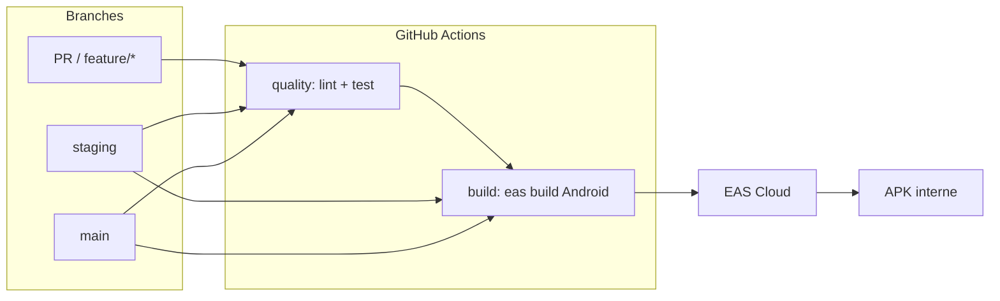

# LivSight Client — CI/CD & builds (EAS)

Guide de référence pour les agents et développeurs : comment les builds sont déclenchés, configurés et récupérés.

**Dernière mise à jour :** 2026-07-04
**Repo :** `livSight/appClient`
**Stack :** Expo 54 · EAS Build · GitHub Actions

---

## 1. Vue d’ensemble



| Canal | Déclencheur | Build EAS | Plateforme |
|-------|-------------|-----------|------------|
| **CI qualité** | push, PR, manuel | Non | — |
| **CI build staging** | push sur `staging` | `preview` | Android APK |
| **CI build prod** | push sur `main` | `production` | Android APK |
| **Local dev** | manuel (`npm run eas:build:dev:*`) | `development` | Android / iOS |

**Non couvert par la CI actuelle :**
- Builds iOS automatiques
- Builds sur branches `feature/*` (sauf lint/test via PR)
- Soumission App Store / Play Store (`eas submit`)

---

## 2. Fichiers source de vérité

| Fichier | Rôle |
|---------|------|
| `.github/workflows/eas-build.yml` | Pipeline GitHub Actions |
| `eas.json` | Profils EAS (`development`, `preview`, `production`) |
| `app.config.js` | Variantes staging/prod (nom app, package Android, Firebase) |
| `app.json` | Config Expo de base (plugins, permissions, bundle id iOS) |
| `package.json` | Scripts `eas:build:*` pour builds locaux |

---

## 3. Pipeline GitHub Actions

Fichier : `.github/workflows/eas-build.yml`

### 3.1 Déclencheurs

- `push` (toutes branches)
- `pull_request`
- `workflow_dispatch` (lancement manuel depuis l’onglet Actions)

### 3.2 Job `quality` (toujours exécuté)

1. Node **20**, `npm ci`
2. `npm run lint` (`expo lint`)
3. `npm test -- --ci --passWithNoTests` (Jest, tests sous `__tests__/**`)

### 3.3 Job `build` (conditionnel)

Conditions **toutes** requises :

- `needs: quality` (le job qualité doit réussir)
- `github.event_name == 'push'` (pas sur les PR)
- Branche = `staging` **ou** `main`

Étapes :

1. `expo/expo-github-action@v8` avec `secrets.EXPO_TOKEN`
2. `npm ci`
3. Si `staging` → `eas build --platform android --profile preview --non-interactive --no-wait`
4. Si `main` → `eas build --platform android --profile production --non-interactive --no-wait`

**`--no-wait`** : le job GitHub se termine dès que le build est **mis en file** sur EAS ; il n’attend pas la fin de la compilation. Suivre l’avancement sur [expo.dev](https://expo.dev).

---

## 4. Profils EAS (`eas.json`)

### 4.1 `development` (local uniquement)

- **Usage :** dev client avec Metro (`npm run start:dev`)
- `developmentClient: true`
- Distribution interne, APK Android
- iOS : appareil physique (`simulator: false`)
- **Pas de variables d’environnement gateway** dans `eas.json` → utiliser `.env` local

```bash
npm run eas:build:dev:android
npm run eas:build:dev:ios
```

### 4.2 `preview` (staging)

Déclenché par la CI sur push `staging`.

| Variable | Valeur |
|----------|--------|
| `APP_VARIANT` | `staging` |
| `EXPO_PUBLIC_GATEWAY_URL` | `https://staging-gateway.livsight.com` |
| `EXPO_PUBLIC_ENABLE_PUSH` | `true` |

- Distribution : **internal** (lien de téléchargement EAS)
- Android : **APK**

### 4.3 `production`

Déclenché par la CI sur push `main`.

| Variable | Valeur |
|----------|--------|
| `APP_VARIANT` | `production` |
| `EXPO_PUBLIC_GATEWAY_URL` | `https://gateway.livsight.com` |
| `EXPO_PUBLIC_ENABLE_PUSH` | `true` |

- Distribution : **internal** (APK téléchargeable ; pas encore config store public)

```bash
npm run eas:build:preview:android
npm run eas:build:preview:ios
npm run eas:build:production   # Android + iOS, manuel
```

---

## 5. Variantes d’app (`app.config.js`)

`APP_VARIANT=staging` (profil `preview`) modifie la config au build :

| Champ | Production | Staging |
|-------|------------|---------|
| Nom affiché | livsight | livsight Staging |
| Package Android | `com.ericdt17.livsightclient` | `com.ericdt17.livsightclient.staging` |
| URL scheme | `livsight` | `livsight-staging` |
| Bundle iOS | `com.ericdt17.livsightclient` | inchangé (même bundle id) |

Les deux variantes Android peuvent être **installées côte à côte** sur le même appareil.

### Firebase Android (`google-services.json`)

- Fichier **gitignoré** → absent des builds EAS sauf secret.
- `app.config.js` lit :
  1. `process.env.GOOGLE_SERVICES_JSON` (secret EAS fichier), ou
  2. `./google-services.json` en local, ou
  3. supprime la clé si absent (build sans push FCM Android).

Créer le secret EAS :

```bash
eas secret:create --scope project --name GOOGLE_SERVICES_JSON --type file --value ./google-services.json
```

---

## 6. Secrets & prérequis

### 6.1 GitHub (obligatoire pour la CI build)

| Secret | Où | Description |
|--------|-----|-------------|
| `EXPO_TOKEN` | GitHub → Settings → Secrets and variables → Actions | Token Expo avec accès EAS ([expo.dev/settings/access-tokens](https://expo.dev/settings/access-tokens)) |

Sans ce secret, le job `build` échoue à l’étape « Setup EAS ».

### 6.2 EAS (recommandé pour push Android)

| Secret | Type | Description |
|--------|------|-------------|
| `GOOGLE_SERVICES_JSON` | file | Fichier Firebase pour FCM Android |

### 6.3 Local (développement)

Copier `.env.example` → `.env` (non versionné, gitignoré). Variables courantes :

```bash
EXPO_PUBLIC_GATEWAY_URL=http://<LAN_IP>:4040
EXPO_PUBLIC_ENABLE_PUSH=true
```

Les variables `EXPO_PUBLIC_*` sont **inlinées au build** ; un changement d’URL gateway nécessite un **nouveau build** (pas seulement Metro) pour les APK `preview`/`production`. Avec le dev client + Metro, `.env` est lu au démarrage de Metro.

---

## 7. Récupérer un build

### Après un push CI

1. Ouvrir [expo.dev](https://expo.dev) → compte `ericdt17` → projet **livsight**
2. Onglet **Builds** → filtrer par profil (`preview` ou `production`)
3. Télécharger l’**APK** une fois le statut `FINISHED`

### En CLI

```bash
npx eas-cli build:list --platform android --limit 5
npx eas-cli build:view <BUILD_ID>
```

### Lien interne

Les profils `preview` et `production` utilisent `distribution: internal` : EAS génère un QR code / URL de téléchargement pour testeurs.

---

## 8. Workflows courants

### Développer une feature (ex. `feature/messaging`)

1. Push / PR → **lint + tests** uniquement (pas de build EAS)
2. Dev local : build dev client une fois, puis `npm run start:dev -- -c`
3. Tester contre gateway locale via `EXPO_PUBLIC_GATEWAY_URL` dans `.env`

### Livrer en staging

1. Merger dans `staging`
2. CI : quality → `eas build --profile preview`
3. Installer l’APK **livsight Staging** sur appareil test
4. Vérifier connexion à `staging-gateway.livsight.com`

### Livrer en production

1. Merger `staging` → `main`
2. CI : quality → `eas build --profile production`
3. Récupérer l’APK prod sur expo.dev
4. *(Futur)* `eas submit` pour Play Store — profil `submit.production` encore vide

### Build iOS manuel

```bash
npm run eas:build:preview:ios    # staging
npm run eas:build:production     # prod (android + ios)
```

Compte Apple / certificats doivent être configurés dans EAS (première fois interactive).

---

## 9. Dépannage

| Symptôme | Cause probable | Action |
|----------|----------------|--------|
| Job `build` absent | Push sur `feature/*` | Normal ; merger vers `staging`/`main` (build ne part que si branche staging/main) |
| `Setup EAS` failed | `EXPO_TOKEN` manquant/expiré | Regénérer le token Expo, mettre à jour le secret GitHub |
| Build EAS `FAILED` | Credentials Android / Firebase | Voir logs sur expo.dev ; vérifier `GOOGLE_SERVICES_JSON` |
| Push ne marche pas sur l’APK | Mauvais profil / gateway | Vérifier `EXPO_PUBLIC_GATEWAY_URL` du profil dans `eas.json` |
| App pointe vers localhost en prod | Mauvais profil build | Ne pas installer un build `development` en prod |
| CI vert mais pas d’APK | `--no-wait` | Attendre la fin sur expo.dev (découplé de GitHub) |
| Deux apps Android | Staging + prod | Packages différents ; comportement voulu |

---

## 10. Commandes rapides

```bash
# Qualité (identique à la CI)
npm ci && npm run lint && npm test

# Dev client (lourd, une fois par changement natif)
npm run eas:build:dev:android
npm run eas:build:dev:ios

# Staging / prod (local, sans attendre la CI)
npm run eas:build:preview:android
npm run eas:build:production

# Metro avec dev client
npm run start:dev -- -c
```

---

## 11. Évolutions possibles (non implémentées)

- Build iOS dans GitHub Actions (`eas build --platform ios`)
- Build sur `workflow_dispatch` avec choix de profil
- `eas build --wait` pour faire échouer la CI si le build EAS échoue
- `buildType: app-bundle` pour Play Store
- `eas submit` automatisé sur tag / release

---

## 12. Références

- [Expo EAS Build](https://docs.expo.dev/build/introduction/)
- [expo-github-action](https://github.com/expo/expo-github-action)
- `CLAUDE.md` — architecture app, env vars, commandes dev
