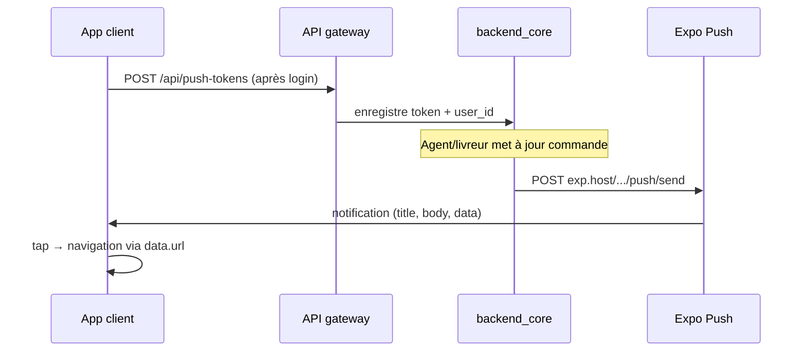

# LivSight — Push notifications (App client)

Guide d'intégration des notifications push Expo pour l'**app client** (`ROLE_CLIENT`), via l'**API gateway** et `backend_core`.

**Dernière mise à jour :** 2026-07-04  
**Backend :** `backend_core`  
**Voir aussi :** [PUSH_NOTIFICATIONS_ROLLOUT.md](./PUSH_NOTIFICATIONS_ROLLOUT.md), [DELIVERY_TRACKING_MOBILE.md](./DELIVERY_TRACKING_MOBILE.md), [TICKETING.md](./TICKETING.md), [PUSH_AGENT.md](./PUSH_AGENT.md), [push-notifications-implementation.md](./push-notifications-implementation.md) (appClient)

---

## Périmètre app client (appClient)

> **Pas de suivi GPS live** dans l'app client. Le statut `processing` ouvre uniquement l'**écran détail commande** (timeline « En cours de livraison ») — pas d'onglet « Suivi live », pas de polling `driver-location`.

### État d'implémentation (appClient)

| Fonctionnalité | Statut | Référence |
|----------------|--------|-----------|
| Enregistrement / suppression token | ✅ Fait | `lib/push/registerPushNotifications.ts` |
| Routage tap par `data.type` | ✅ Fait | `lib/push/notificationRouting.ts` |
| Détail livraison vs expédition | ✅ Fait | `lib/push/resolveTransactionDetailPath.ts` |
| Refresh foreground (liste + détail) | ✅ Fait | `lib/push/pushNotificationEvents.ts` |
| Re-sync token au retour app | ✅ Fait | `lib/push/usePushNotifications.ts` |
| Suivi GPS live / carte livreur | ❌ Hors scope | N/A — client app |
| Compteur badge non lus push | ❌ Non implémenté | Resync via focus écran |

Guide développeur détaillé : [push-notifications-implementation.md](./push-notifications-implementation.md).

---

## 1. Idée centrale

Le backend envoie un push **Expo** quand quelque chose d'important arrive sur **vos commandes** : création, assignation livreur, changement de statut, frais confirmés, réponse support.

**Sans token enregistré → aucun push** (le backend ignore silencieusement).

**Vous ne recevez pas** le push que **vous** venez de déclencher (ex. vous changez le statut vous-même — rare côté client).



---

## 2. Prérequis Expo (React Native)

Utiliser **`expo-notifications`** (SDK Expo recommandé).

### 2.1 Permissions

1. Demander la permission notifications au premier lancement (ou après login).
2. Si refusée : l'app fonctionne sans push ; proposer un rappel dans Paramètres.

### 2.2 Obtenir le token

```typescript
import * as Notifications from "expo-notifications";
import * as Device from "expo-device";
import { Platform } from "react-native";

async function getExpoPushToken(): Promise<string | null> {
  if (!Device.isDevice) {
    return null; // simulateur iOS ne reçoit pas de vrais push
  }

  const { status: existing } = await Notifications.getPermissionsAsync();
  let finalStatus = existing;
  if (existing !== "granted") {
    const { status } = await Notifications.requestPermissionsAsync();
    finalStatus = status;
  }
  if (finalStatus !== "granted") {
    return null;
  }

  const projectId = "<your-expo-project-id>"; // app.json extra.eas.projectId
  const token = await Notifications.getExpoPushTokenAsync({ projectId });
  return token.data; // ExponentPushToken[...]
}
```

### 2.3 Handler foreground (recommandé)

```typescript
Notifications.setNotificationHandler({
  handleNotification: async () => ({
    shouldShowAlert: true,
    shouldPlaySound: true,
    shouldSetBadge: true,
  }),
});
```

Afficher quand même une alerte in-app si l'utilisateur est sur l'écran commande concernée (badge / bannière discrète).

---

## 3. Authentification

Tous les appels passent par la **gateway** avec `Authorization: Bearer <JWT>`. La gateway injecte `X-User-Id` (sub Keycloak). **L'app ne doit pas** définir ce header elle-même.

Rôle requis en base : **`ROLE_CLIENT`**, lié à `X-User-Id`.

---

## 4. Enregistrer le token (obligatoire)

### 4.1 À la connexion (et au refresh token)

```http
POST /api/push-tokens
Authorization: Bearer <token>
Content-Type: application/json

{
  "expoPushToken": "ExponentPushToken[xxxxxxxx]",
  "platform": "ios"
}
```

| Champ | Valeurs |
|-------|---------|
| `expoPushToken` | Token Expo complet |
| `platform` | `"ios"` ou `"android"` |

Réponse `200` :

```json
{ "message": "Push token registered" }
```

**Quand appeler :**

- Après login réussi
- Au retour app (si token Expo a changé)
- Après réinstallation app / changement d'appareil

Le backend **upsert** : un même token peut être réassigné au user courant.

### 4.2 Supprimer le token (déconnexion)

```http
DELETE /api/push-tokens
Authorization: Bearer <token>
Content-Type: application/json

{ "expoPushToken": "ExponentPushToken[xxxxxxxx]" }
```

Corps **vide** ou absent → supprime **tous** les tokens de l'utilisateur.

**Quand appeler :** logout explicite, « Se déconnecter de cet appareil ».

---

## 5. Push reçus par le client

Catalogue **implémenté** dans `TransactionNotificationService` et `TicketNotificationService`.

### 5.1 Commandes / livraisons

| `data.type` | Déclencheur | Titre typique (`title`) |
|-------------|-------------|-------------------------|
| `transaction_created` | Commande créée | `Commande reçue` |
| `driver_assigned` | Premier assignation livreur | `Livreur assigné` |
| `driver_reassigned` | Changement de livreur | `Livreur modifié` |
| `driver_cleared` | Livreur retiré | `Livreur retiré` |
| `transaction_status_changed` | Changement de statut | Voir tableau §5.3 |
| `delivery_fee_finalized` | `delivery_fee_pending` passé à `false` | `Frais de livraison confirmés` |

> **`transaction_created`** est contrôlé par la config serveur `push.notify-client-on-create` (défaut : `true`). Si désactivé en prod, ce push n'arrive pas.

### 5.2 Support (tickets)

| `data.type` | Déclencheur | Titre typique |
|-------------|-------------|---------------|
| `ticket_message` | **Agent** répond sur le canal `client` | `Nouveau message support` |

Le client **ne reçoit pas** de push quand **il** envoie un message (l'agent est notifié à la place).

Canal `driver` : réservé livreur ↔ agent — **ignorer** côté app client.

### 5.3 Statuts (`transaction_status_changed`)

Le backend envoie un push au client à **chaque** changement de statut significatif.

| Statut | Titre (`title`) | Action UI suggérée |
|--------|-----------------|-------------------|
| `pending` | Commande en attente | Détail commande |
| `processing` | Livraison en cours | Détail commande (timeline « En cours ») — **pas de suivi GPS live** côté client |
| `completed` | Livraison terminée | Écran récap / notation |
| `collected_at_office` | Colis récupéré au bureau | Détail commande |
| `failed` | Livraison échouée | Détail + CTA support |
| `postponed` | Livraison reportée | Détail commande |
| `client_absent` | Client absent | Info + reprogrammation |
| `unreachable` | Client injoignable | Info |
| `does_not_pick_up` | Client ne répond pas | Info |
| `events` | Mise à jour livraison | Détail commande |

Corps (`body`) : `{title} — {transactionReference}` (ex. `Livraison en cours — TX-2026-001`).

### 5.4 Ce que le client ne reçoit **pas**

| Événement | Pourquoi |
|-----------|----------|
| `agency_new_order` | Réservé agents |
| Assignation faite **par vous** | Suppression de l'acteur |
| Message ticket **envoyé par vous** | L'agent est notifié |
| Mise à jour position GPS | Pas de push dédié — polling sur écran suivi |
| Changement montant / quantité seul | Hors scope push |

---

## 6. Payload reçu (Expo)

Structure envoyée par Expo à l'app :

```json
{
  "title": "Livraison en cours",
  "body": "Livraison en cours — TX-2026-001",
  "data": {
    "type": "transaction_status_changed",
    "transactionId": "1001",
    "url": "/transactions/1001"
  }
}
```

### 6.1 Champs `data` (routage)

| Champ | Présent | Usage |
|-------|:-------:|-------|
| `type` | Toujours | Discriminant navigation |
| `transactionId` | Commandes | ID numérique (string) |
| `url` | Presque toujours | Chemin deep link relatif |
| `ticketId` | Tickets | ID ticket support |
| `channel` | Tickets | `"client"` — vérifier avant d'ouvrir le chat |
| `transactionReference` | Parfois | **Debug uniquement — ne pas afficher** |
| `quartier` | Parfois | **Debug uniquement — ne pas afficher** |

> Les IDs sont des **strings** dans `data` (serialization Expo). Parser avec `Number(data.transactionId)` ou comparer en string.

### 6.2 Exemples complets

**Livreur assigné :**

```json
{
  "title": "Livreur assigné",
  "body": "Livreur assigné — TX-2026-001",
  "data": {
    "type": "driver_assigned",
    "transactionId": "1001",
    "url": "/transactions/1001"
  }
}
```

**Frais confirmés :**

```json
{
  "title": "Frais de livraison confirmés",
  "body": "Frais confirmés : 2500 XAF — TX-2026-001",
  "data": {
    "type": "delivery_fee_finalized",
    "transactionId": "1001",
    "url": "/transactions/1001"
  }
}
```

**Message support agent :**

```json
{
  "title": "Nouveau message support",
  "body": "Réponse sur votre ticket #12",
  "data": {
    "type": "ticket_message",
    "ticketId": "12",
    "transactionId": "1001",
    "channel": "client",
    "url": "/tickets/12"
  }
}
```

---

## 7. Routage au tap (navigation)

### 7.1 Table de routage

| `data.type` | Écran cible |
|-------------|-------------|
| `transaction_created` | Détail commande `transactionId` |
| `driver_assigned` | Détail commande — bannière « Livreur assigné » |
| `driver_reassigned` | Détail commande |
| `driver_cleared` | Détail commande |
| `transaction_status_changed` | Détail commande (livraison ou expédition selon `type`) |
| `delivery_fee_finalized` | Détail commande — section frais |
| `ticket_message` | Chat support commande (canal `client`) |

### 7.2 Mapper `data.url`

Le backend envoie des chemins relatifs :

| `url` | Route app suggérée | Route Expo Router (appClient) |
|-------|-------------------|------------------------------|
| `/transactions/{id}` | `OrderDetailScreen` avec `id` | `/livraison-detail/[id]` ou `/expedition-detail/[id]` (résolu via `GET /api/transactions/{id}`) |
| `/tickets/{id}` | `SupportChatScreen` avec `ticketId` + `transactionId` | `/inbox/[id]` (`id` = `transactionId`) |

Exemple React Navigation :

```typescript
function navigateFromPush(data: ClientPushData, navigation: NavigationProp) {
  const txId = data.transactionId ? Number(data.transactionId) : undefined;
  const ticketId = data.ticketId ? Number(data.ticketId) : undefined;

  switch (data.type) {
    case "ticket_message":
      if (data.channel !== "client") return;
      navigation.navigate("SupportChat", { ticketId, transactionId: txId });
      break;
    case "transaction_created":
    case "driver_assigned":
    case "driver_reassigned":
    case "driver_cleared":
    case "delivery_fee_finalized":
    case "transaction_status_changed":
      if (txId) {
        navigation.navigate("OrderDetail", {
          id: txId,
          openTracking: data.type === "transaction_status_changed",
        });
      }
      break;
  }
}
```

### 7.3 Listeners Expo

```typescript
// App tuée / background → tap notification
const subscription = Notifications.addNotificationResponseReceivedListener((response) => {
  const data = response.notification.request.content.data as ClientPushData;
  navigateFromPush(data, navigation);
});

// App foreground → notification reçue
Notifications.addNotificationReceivedListener((notification) => {
  const data = notification.request.content.data as ClientPushData;
  // Rafraîchir liste commandes ou détail si écran ouvert
  refreshOrdersIfNeeded(data.transactionId);
});
```

---

## 8. Lien avec le suivi GPS live

> **N/A — app client.** L'app client n'implémente pas le suivi GPS live (carte, polling `driver-location`, onglet « Suivi live »). Tous les push commande ouvrent l'écran **détail** uniquement.

Il **n'existe pas** de push « position mise à jour » côté backend. Pour une app avec suivi live (ex. app livreur), le flux recommandé est décrit dans [DELIVERY_TRACKING_MOBILE.md §5](./DELIVERY_TRACKING_MOBILE.md) — **hors scope appClient**.

---

## 9. Lien avec le support (tickets)

Canal client : **`client`** uniquement.

| Action | API |
|--------|-----|
| Voir thread existant | `GET /api/tickets/transaction/{orderId}?channel=client` |
| Premier message | `POST /api/messages/new` avec `"channel": "client"` |
| Répondre | `PUT /api/messages/{ticketId}` |
| Marquer lu | `PUT /api/messages/{ticketId}` avec `{ "messageRead": true }` (GET retourne `isMessageRead`) |

Au tap sur `ticket_message` :

1. Naviguer vers le chat de la commande `transactionId`
2. Charger messages `GET /api/tickets/messages?ticketId=`
3. Marquer lu si l'utilisateur ouvre le thread

Référence : [TICKETING.md §Client app](./TICKETING.md).

---

## 10. Affichage UI

- Utiliser **`title`** et **`body`** tels quels — déjà en **français** côté backend.
- Ne pas reconstruire le texte à partir de `type` sauf fallback si `body` absent.
- Badge : incrémenter onglet « Commandes » ou icône cloche ; resync via `GET /api/transactions` au focus app.
- **Ne pas afficher** `transactionReference` / `quartier` depuis `data` en UI (champs debug).

---

## 11. Cycle de vie token (checklist)

```
Login OK
  → permission notifications
  → getExpoPushToken()
  → POST /api/push-tokens

App revient au premier plan
  → revérifier token Expo (peut changer)
  → POST si différent du dernier enregistré

Logout
  → DELETE /api/push-tokens (corps vide = tout supprimer)
  → optionnel : DELETE avec expoPushToken spécifique
```

---

## 12. Gestion des erreurs

| Situation | Comportement |
|-----------|--------------|
| Pas de permission OS | App OK sans push ; CTA paramètres |
| `POST /api/push-tokens` échoue | Retry backoff ; ne pas bloquer login |
| Token invalide (`DeviceNotRegistered`) | Backend purge automatiquement — ré-enregistrer au prochain login |
| `403` sur API commande | Session expirée — refresh token / re-login |
| Tap push commande supprimée | `404` sur GET → message « Commande introuvable » |

---

## 13. API quick reference (client)

| Action | Méthode | Endpoint |
|--------|---------|----------|
| Enregistrer token | POST | `/api/push-tokens` |
| Supprimer token(s) | DELETE | `/api/push-tokens` |
| Mes commandes | GET | `/api/transactions` |
| Détail commande | GET | `/api/transactions/{id}` |
| Suivi GPS live | GET | `/api/transactions/{id}/driver-location` — **N/A app client** |
| Tickets commande | GET | `/api/tickets/transaction/{id}?channel=client` |
| Messages ticket | GET | `/api/tickets/messages?ticketId=` |

---

## 14. Types TypeScript

```typescript
type ClientPushType =
  | "transaction_created"
  | "driver_assigned"
  | "driver_reassigned"
  | "driver_cleared"
  | "transaction_status_changed"
  | "delivery_fee_finalized"
  | "ticket_message";

interface PushTokenRegisterRequest {
  expoPushToken: string;
  platform: "ios" | "android";
}

interface ClientPushData {
  type: ClientPushType;
  transactionId?: string;
  ticketId?: string;
  channel?: "client" | "driver";
  url?: string;
  /** Debug only — do not display */
  transactionReference?: string;
  /** Debug only — do not display */
  quartier?: string;
}
```

---

## 15. Checklist d'intégration complète

### Setup Expo

- [ ] `expo-notifications` installé et configuré (iOS capabilities, Android channel)
- [ ] `projectId` Expo renseigné pour `getExpoPushTokenAsync`
- [ ] Test sur **appareil physique** (pas simulateur iOS pour push réels)

### Token backend

- [ ] `POST /api/push-tokens` après chaque login réussi
- [ ] Re-sync token au retour app (AppState `active`)
- [ ] `DELETE /api/push-tokens` au logout

### Réception & navigation

- [ ] Listener tap notification (background / killed)
- [ ] Listener foreground (refresh UI)
- [ ] Routage par `data.type` + `transactionId` / `ticketId`
- [ ] Ignorer `ticket_message` si `channel !== "client"`

### Commandes

- [x] Tap statut `processing` → détail commande uniquement (**N/A** suivi GPS / polling)
- [x] Tap `driver_assigned` → détail sans carte live
- [x] Tap statut terminal → détail commande (**N/A** arrêt polling)
- [ ] Rafraîchir liste commandes après push foreground

### Support

- [ ] Tap `ticket_message` → chat canal client
- [ ] Marquer ticket lu à l'ouverture

### UX

- [ ] Afficher `title` / `body` backend tels quels
- [ ] Badge / compteur non lus
- [ ] Gérer absence de push (permission refusée) sans bloquer l'app

---

## 16. Test manuel

1. Login client sur appareil physique → vérifier `POST /api/push-tokens` en 200.
2. Créer commande (app ou bot) → push `transaction_created` (si activé serveur).
3. Agent assigne livreur → push `driver_assigned`.
4. Livreur passe `processing` → push `Livraison en cours` ; tap ouvre **détail commande** (pas de carte live).
5. Livreur passe `completed` → push `Livraison terminée`.
6. Agent répond ticket → push `ticket_message` ; tap ouvre chat.
7. Logout → `DELETE /api/push-tokens` ; plus de push sur cet appareil.

**Debug backend :** si aucun push, vérifier table `push_tokens` (ligne pour `user_id` client) et logs `Push skipped (no token)`.

---

## 17. Configuration serveur (info)

Variables `backend_core` (`.env` / VPS) :

| Variable | Défaut | Effet client |
|----------|--------|--------------|
| `PUSH_NOTIFY_CLIENT_ON_CREATE` | `true` | Push `transaction_created` |
| `EXPO_ACCESS_TOKEN` | vide | Token Expo optionnel (envois production) |

Le client **n'a pas** à gérer ces flags — comportement transparent.

---

## 18. Références code backend

| Composant | Fichier |
|-----------|---------|
| Enregistrement token | `PushTokenController`, `PushTokenService` |
| Push commandes | `TransactionNotificationService` |
| Push tickets | `TicketNotificationService` |
| Envoi Expo | `ExpoPushService`, `PushDeliveryService` |
| Types | `PushNotificationType` |
| Config | `PushNotificationProperties` |
