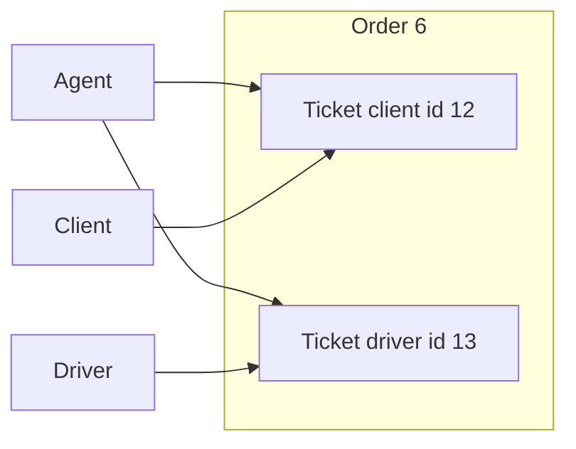
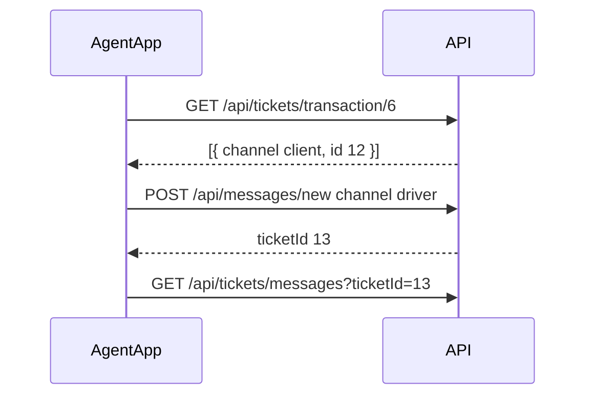

# LivSight — Ticketing (agent app frontend)

Integration guide for the **agent** mobile/web app: dual-channel support chat per order via the API gateway → `backend_core`.

**See also:**

- [messaging-client-implementation.md](./messaging-client-implementation.md) — what **appClient** already ships (read/unread, parsing quirks)
- [TICKETING.md](./TICKETING.md) — shared reference for client, driver, and agent teams (when present in monorepo)

**Last updated:** 2026-06-14  
**Backend status:** Dual-channel ticketing is **implemented** — up to **two tickets per order** (`client` + `driver`).

---

## 1. Core idea (read this first)

Each **order** (`transactionId`) can have **two independent chat threads**:

| Tab (UI) | API `channel` | Who you talk to |
|----------|---------------|-----------------|
| **Client** | `client` | Order owner (client) |
| **Livreur / Driver** | `driver` | Assigned driver (`driver_id` on the order) |



**Important:**

- A **client ticket already existing does NOT block** a driver ticket on the same order.
- Uniqueness is **`(transactionId, channel)`**, not `transactionId` alone.
- Client and driver **never** see each other's messages — only agents see both.
- You (agent) may **open either thread first**, including messaging the driver before they write.

---

## 2. What changed vs old API

| Old behavior | New behavior |
|--------------|--------------|
| One ticket per order | Up to **two** tickets per order |
| `GET /api/tickets/transaction/{id}` → single object | Returns an **array** (0–2 items) |
| `POST /api/messages/new` without `channel` | **`channel` required**: `"client"` or `"driver"` |
| Opening driver chat failed if client ticket existed | **Allowed** — different `channel` |

If the Livreur tab shows a friendly error, check: backend deployed, DB migrated, and the app sends `"channel": "driver"`.

---

## 3. Authentication

- All calls: gateway URL + `Authorization: Bearer <token>`
- Gateway sets `X-User-Id` (Keycloak ID). **Do not** set identity headers from the app.
- Agent inbox requires `ROLE_AGENT` or `ROLE_ADMIN` in the backend user record.

---

## 4. Data shapes

### TicketResponse

```json
{
  "id": 13,
  "channel": "driver",
  "status": "pending",
  "createdAt": "2026-06-14T10:00:00",
  "lastUpdatedAt": "2026-06-14T10:05:00",
  "isMessageRead": false,
  "assignedAgent": 3,
  "createdBy": 3,
  "transaction": 6
}
```

| Field | Notes |
|-------|-------|
| `id` | Use for **replies** and loading messages |
| `channel` | `"client"` or `"driver"` — match to your tab |
| `assignedAgent` | `null` until an agent sends the first reply on that thread |
| `isMessageRead` | Ticket-level unread (not per-message) |
| `transaction` | Order ID |

### TicketMessageResponse

```json
{
  "content": "Bonjour",
  "ticketId": 13,
  "senderId": 3,
  "createdAt": "2026-06-14T10:00:00"
}
```

Align bubbles: `senderId === currentUser.id` → outgoing, else incoming.

### Ticket statuses

`pending` (default) · `open` · `inProgress` · `resolved` · `closed`  
Send exact strings in `TicketStatus` on update.

---

## 5. Agent UI model

### Order detail — two tabs

```
Commande #6
├── [Client]   ticket #12  ● unread
└── [Livreur]  pas encore de conversation  (driver assigné: Jean)
```

**Rules:**

1. Read `driver_id` from the **transaction** object (order detail API).
2. **Livreur tab disabled** if `driver_id` is null — show “Aucun livreur assigné”.
3. Each tab has its **own** `ticketId` and message list — do not merge threads.
4. Badge per tab: `ticket.isMessageRead === false` for that channel's ticket.

### Inbox (global)

- `GET /api/tickets` — agency-scoped, agent only
- Optional filters: `?channel=client|driver` · `?unread=true`
- Sort by `lastUpdatedAt` descending
- Show `channel` in list row so agent knows client vs livreur thread

---

## 6. Step-by-step flows

### 6.1 Load both channels on order open

```http
GET /api/tickets/transaction/6
Authorization: Bearer <token>
```

**Response (array, 0–2 items):**

```json
[
  {
    "id": 12,
    "channel": "client",
    "status": "pending",
    "isMessageRead": false,
    "assignedAgent": null,
    "createdBy": 42,
    "transaction": 6,
    "createdAt": "...",
    "lastUpdatedAt": "..."
  }
]
```

**Frontend parsing:**

```typescript
function mapTicketsByChannel(tickets: TicketResponse[]) {
  return {
    client: tickets.find((t) => t.channel === "client") ?? null,
    driver: tickets.find((t) => t.channel === "driver") ?? null,
  };
}
```

Optional filter per tab:

```http
GET /api/tickets/transaction/6?channel=driver
```

---

### 6.2 Client tab — thread exists

1. `ticketId = clientTicket.id`
2. `GET /api/tickets/messages?ticketId=12`
3. On tab focus: `PUT /api/messages/12` with `{ "isMessageRead": true }`
4. Send reply: `PUT /api/messages/12` with `{ "content": "..." }`

---

### 6.3 Client tab — no thread yet

User sends first message:

```http
POST /api/messages/new
Content-Type: application/json
```

```json
{
  "transactionId": 6,
  "channel": "client",
  "content": "Bonjour, comment puis-je vous aider ?"
}
```

**Response:**

```json
{
  "content": "Bonjour...",
  "ticketId": 12,
  "senderId": 3,
  "createdAt": "..."
}
```

Store `ticketId` for this tab; load messages after.

---

### 6.4 Livreur tab — client ticket exists, driver ticket does not

This is the main scenario that **now works** on the backend.

**Precondition:** order has `driver_id` set.

1. `GET /api/tickets/transaction/6` → array has client ticket only
2. Agent sends first livreur message:

```json
POST /api/messages/new
{
  "transactionId": 6,
  "channel": "driver",
  "content": "Pouvez-vous confirmer la prise en charge ?"
}
```

3. Response includes new `ticketId` (e.g. `13`) — **different** from client ticket `12`
4. Livreur tab uses `ticketId: 13` for messages and replies



---

### 6.5 Livreur tab — thread already exists

Same as client tab: `GET messages` + `PUT` to reply. **Do not** `POST /new` again.

---

### 6.6 Reply and update (both tabs)

```http
PUT /api/messages/{ticketId}
```

> `{ticketId}` = **ticket** ID, not message ID.

```json
{
  "content": "Réponse agent",
  "isMessageRead": true,
  "TicketStatus": "inProgress"
}
```

All fields optional — send only what you need.

**First agent reply on a thread:**

- Sets `assignedAgent` to you
- Sets `isMessageRead` to `false` for the other party

---

## 7. Decision tree (implement in app)

```
On order detail load:
  GET /api/tickets/transaction/{orderId}
  → split by channel → clientTicket | driverTicket

Client tab send:
  if clientTicket → PUT /api/messages/{clientTicket.id}
  else            → POST /api/messages/new { channel: "client", ... }

Livreur tab send:
  if !order.driver_id → show "Aucun livreur assigné" (disable input)
  if driverTicket     → PUT /api/messages/{driverTicket.id}
  else                → POST /api/messages/new { channel: "driver", ... }

On POST /new response 409:
  → thread already exists; refetch GET /transaction/{id} and use PUT

On POST /new response 400 + driver channel:
  → no driver on order yet
```

---

## 8. HTTP errors — show friendly copy

| Status | When | Suggested UI (FR) |
|--------|------|-------------------|
| **400** | `channel: "driver"` but no `driver_id` on order | « Aucun livreur n'est assigné à cette commande. » |
| **400** | Missing `channel` on create | Dev error — always send `channel` |
| **403** | Not agent / wrong access | « Accès refusé. » |
| **404** | Order or ticket not found | « Conversation introuvable. » |
| **409** | Thread already exists for this channel | Refetch tickets, then reply with PUT — « Conversation déjà ouverte. » |

**Do not treat 409 on driver channel as “client ticket blocks driver”** — 409 means **that specific channel** already has a ticket.

---

## 9. Agent inbox

```http
GET /api/tickets
GET /api/tickets?channel=driver&unread=true
```

- **403** if not agent/admin
- Scoped to your **agency** (orders whose client belongs to your agency)
- Not a global dump of all platform tickets

---

## 10. Push notifications

Register token: `POST /api/push-tokens`

On `ticket_message` tap, open the correct tab using payload:

```json
{
  "type": "ticket_message",
  "ticketId": "13",
  "transactionId": "6",
  "channel": "driver",
  "url": "/tickets/13"
}
```

| You receive push when | Open |
|-----------------------|------|
| Client wrote on `client` channel | Order → **Client** tab |
| Driver wrote on `driver` channel | Order → **Livreur** tab |

---

## 11. TypeScript (copy-paste)

```typescript
type TicketChannel = "client" | "driver";

type TicketStatus =
  | "pending"
  | "open"
  | "inProgress"
  | "resolved"
  | "closed";

interface TicketResponse {
  id: number;
  channel: TicketChannel;
  status: TicketStatus;
  createdAt: string;
  lastUpdatedAt: string;
  isMessageRead: boolean;
  assignedAgent: number | null;
  createdBy: number;
  transaction: number;
}

interface TicketMessageResponse {
  content: string;
  ticketId: number;
  senderId: number;
  createdAt: string;
}

interface CreateTicketRequest {
  transactionId: number;
  channel: TicketChannel;
  content: string;
}

interface UpdateTicketRequest {
  content?: string;
  isMessageRead?: boolean;
  TicketStatus?: TicketStatus;
}

async function loadOrderTickets(
  api: ApiClient,
  transactionId: number
): Promise<{ client: TicketResponse | null; driver: TicketResponse | null }> {
  const tickets = await api.get<TicketResponse[]>(
    `/api/tickets/transaction/${transactionId}`
  );
  return {
    client: tickets.find((t) => t.channel === "client") ?? null,
    driver: tickets.find((t) => t.channel === "driver") ?? null,
  };
}

async function sendAgentMessage(
  api: ApiClient,
  transactionId: number,
  channel: TicketChannel,
  content: string,
  existingTicket: TicketResponse | null
): Promise<number> {
  if (existingTicket) {
    await api.put(`/api/messages/${existingTicket.id}`, { content });
    return existingTicket.id;
  }
  const created = await api.post<TicketMessageResponse>("/api/messages/new", {
    transactionId,
    channel,
    content,
  });
  return created.ticketId;
}
```

---

## 12. Common mistakes

| Mistake | Fix |
|---------|-----|
| Expect one ticket per order | Two max — map by `channel` |
| Parse transaction tickets as object | Always an **array** |
| `POST /new` for every send | POST only when no ticket for that channel; else PUT |
| Same `ticketId` for both tabs | Each channel has its own `id` |
| Livreur create without `channel: "driver"` | Always set `channel` |
| `PUT /api/messages/{messageId}` | Use **ticket** id |
| Show 409 as fatal crash | Refetch + switch to PUT |

---

## 13. API quick reference

| Action | Method | Endpoint |
|--------|--------|----------|
| Tickets for order | GET | `/api/tickets/transaction/{transactionId}` |
| Filter one channel | GET | `/api/tickets/transaction/{id}?channel=driver` |
| Messages | GET | `/api/tickets/messages?ticketId={ticketId}` |
| Open thread | POST | `/api/messages/new` |
| Reply / mark read / status | PUT | `/api/messages/{ticketId}` |
| One ticket | GET | `/api/tickets/{ticketId}` |
| Agent inbox | GET | `/api/tickets?channel=&unread=` |

---

## 14. Checklist before shipping Livreur tab

- [ ] `GET /api/tickets/transaction/{id}` parsed as **array**
- [ ] Tickets stored in state keyed by `channel`, not single `ticketId`
- [ ] Create sends `"channel": "driver"` when livreur thread missing
- [ ] Livreur input disabled when `transaction.driver_id == null`
- [ ] **409** on create triggers refetch + PUT, not crash
- [ ] Push deep link uses `channel` to select Client vs Livreur tab
- [ ] Backend with dual-channel code deployed (see TICKETING.md §15 for DB notes)

---

## 15. Production notes from appClient (verified on gateway)

These behaviours were confirmed while wiring **appClient** (`lib/api/tickets.ts`). Reuse the same defensive parsing in the agent app.

### Mark-read PUT body field

Official spec shows `isMessageRead` on PUT. The live gateway accepts:

```json
{ "messageRead": true }
```

Read the flag from GET as **`isMessageRead`** (also accept `is_message_read` / `messageRead` in parsers).

### PUT response is often not a full ticket

Success may return only:

```json
{ "message": "Message ticket updated successfully" }
```

After mark-read or reply, **refetch** `GET /api/tickets/{ticketId}` when the body has no ticket `id`. See `resolveTicketFromUpdateResponse()` in appClient.

### Ticket id field aliases

List/detail items may use `id`, `ticketId`, or `ticket_id`. Never call APIs with `NaN` — validate numeric ids before `GET /api/tickets/messages?ticketId=`.

### POST /new response shape

First message may return a **message** object (`ticketId`, `content`, `senderId`) rather than a full `TicketResponse`. Store `ticketId` from the response, then load messages.

### Read / unread UX pattern (copy for agent app)

| Step | Action |
|------|--------|
| List badge | `!ticket.isMessageRead` per channel |
| Open tab / chat | `PUT { messageRead: true }` then refetch ticket if needed |
| Return to list | `useFocusEffect` (or equivalent) to refetch tickets |
| Inbox (agent) | `GET /api/tickets?unread=true` + per-channel badge |

### Suggested agent module layout (mirror appClient)

| Module | Responsibility |
|--------|----------------|
| `lib/api/tickets.ts` | HTTP, parsing, `mapTicketsByChannel`, `loadAgentThread(channel)`, `sendAgentMessage`, `markTicketRead`, `resolveTicketFromUpdateResponse` |
| `lib/api/ticketUi.ts` | Unread subtitles, sort, bubble sides |
| Order detail screen | Two tabs, state `{ client: Ticket \| null, driver: Ticket \| null }` |
| Agent inbox screen | `GET /api/tickets` with filters |

Reference implementation: `appClient/lib/api/tickets.ts`, `app/conversations.tsx`, `app/inbox/[id].tsx`.
