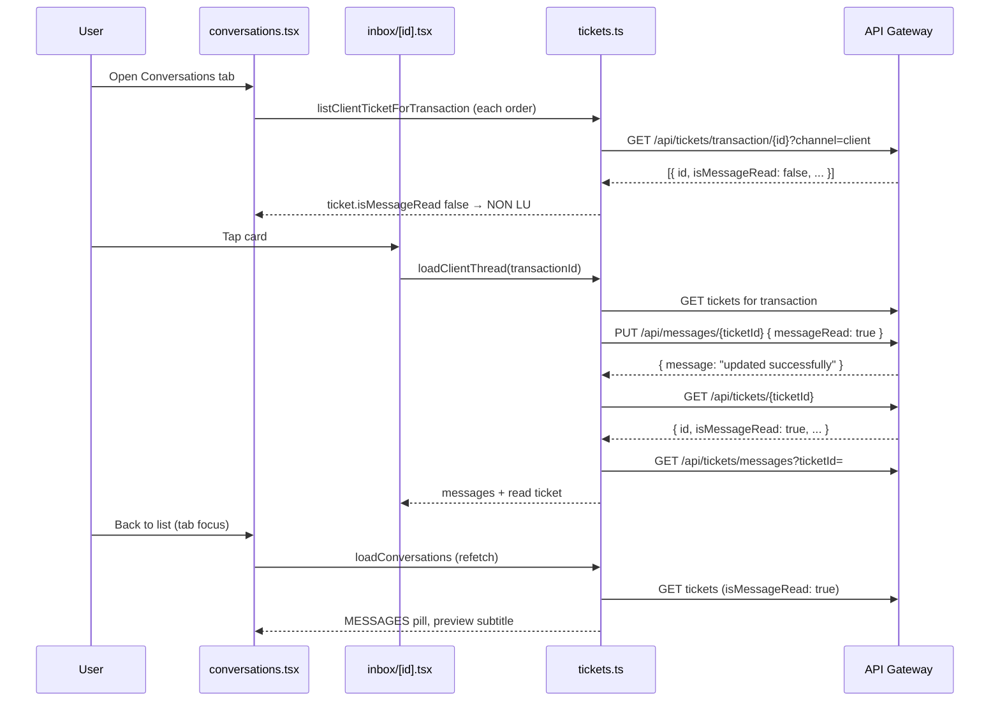

# LivSight — Client messaging implementation

Guide for how **appClient** integrates ticketing/messaging with `backend_core` via the API gateway.

**See also:** [messaging-agent-implementation.md](./messaging-agent-implementation.md) — dual-channel agent app guide (backend confirmed implemented).

**Last updated:** 2026-06-14

---

## Overview

Each order can have up to **two support threads**:

| Channel   | Conversation              | Client app | Agent app |
|-----------|---------------------------|------------|-----------|
| `client`  | Agent ↔ order owner       | ✅ only channel used | ✅ |
| `driver`  | Agent ↔ assigned driver   | ❌ hidden  | ✅ |

The client app never opens or reads the `driver` channel.

---

## Architecture (appClient)

```
┌─────────────────────────────────────────────────────────────────┐
│  UI layer                                                       │
│  app/conversations.tsx          Inbox list (tab)                │
│  app/inbox/[id].tsx             Chat screen                     │
│  app/livraison-detail/[id].tsx  "Signaler un problème" entry    │
│  app/expedition-detail/[id].tsx same                            │
└───────────────────────────┬─────────────────────────────────────┘
                            │
┌───────────────────────────▼─────────────────────────────────────┐
│  Presentation helpers                                           │
│  lib/api/conversationUi.ts   TransactionCard mapping            │
│  lib/api/ticketUi.ts         Unread, subtitles, sort, bubbles   │
└───────────────────────────┬─────────────────────────────────────┘
                            │
┌───────────────────────────▼─────────────────────────────────────┐
│  API layer                                                      │
│  lib/api/tickets.ts          All ticket/message HTTP calls      │
│  lib/api/client.ts           Bearer token + 401 logout          │
└───────────────────────────┬─────────────────────────────────────┘
                            │
                     API gateway (EXPO_PUBLIC_GATEWAY_URL)
```

### Key files

| File | Responsibility |
|------|----------------|
| `lib/api/tickets.ts` | HTTP client, parsing, mark-read, send, load thread |
| `lib/api/ticketUi.ts` | Unread badge logic, list subtitles, message bubble sides |
| `lib/api/conversationUi.ts` | Map enriched conversation → `TransactionCard` |
| `app/conversations.tsx` | Inbox list: load tickets + refresh on focus |
| `app/inbox/[id].tsx` | Chat: load messages, send, mark read on open |
| `lib/push/notificationRouting.ts` | Deep-link all push types; `ticket_message` client channel only |
| `lib/push/usePushNotifications.ts` | Token lifecycle, tap navigation, foreground events |
| `__tests__/api/tickets.test.ts` | API + read/unread behaviour tests |

---

## Data model

### Ticket (`TicketResponse`)

| Field | Type | Usage in client app |
|-------|------|---------------------|
| `id` | `number` | Reply URL, messages query, mark-read |
| `channel` | `"client"` \| `"driver"` | Client app filters to `client` only |
| `status` | string | Not shown in inbox v1 |
| `createdAt` | ISO string | — |
| `lastUpdatedAt` | ISO string | Sort inbox, relative time label |
| **`isMessageRead`** | **`boolean`** | **Single source of truth for unread UI** |
| `assignedAgent` | number \| null | — |
| `createdBy` | number | — |
| `transaction` | number | Numeric order id |

### Message (`TicketMessage`)

| Field | Type |
|-------|------|
| `id` | number (optional) |
| `content` | string |
| `ticketId` | number |
| `senderId` | number |
| `createdAt` | ISO string |

---

## API endpoints (client role)

All calls use `apiFetch` with the session Bearer token. Do **not** set `X-User-Id` manually — the gateway injects it.

| Action | Method | Endpoint |
|--------|--------|----------|
| List tickets for order | GET | `/api/tickets/transaction/{transactionId}?channel=client` |
| Get one ticket | GET | `/api/tickets/{ticketId}` |
| Load messages | GET | `/api/tickets/messages?ticketId={ticketId}` |
| Open thread (first message) | POST | `/api/messages/new` |
| Reply / update ticket | PUT | `/api/messages/{ticketId}` |

**Agent-only (not used in client app):** `GET /api/tickets?channel=client&unread=true`

### Open thread

```http
POST /api/messages/new
Content-Type: application/json

{
  "transactionId": 1001,
  "channel": "client",
  "content": "Premier message"
}
```

- Returns **409** if a `client` thread already exists → fetch existing ticket and `PUT` instead.

### Reply / mark read

```http
PUT /api/messages/{ticketId}
Content-Type: application/json

{ "content": "Réponse" }
```

Mark read (no new message):

```http
PUT /api/messages/{ticketId}
Content-Type: application/json

{ "messageRead": true }
```

> **Important:** The backend accepts `messageRead` on the PUT body (not `isMessageRead`). The GET/list responses expose the flag as **`isMessageRead`**.

### PUT response shape (gotcha)

A successful PUT often returns **only**:

```json
{ "message": "Message ticket updated successfully" }
```

It does **not** return the full ticket object. The client must **refetch** the ticket after mark-read or reply when the response has no parseable ticket `id`. See `resolveTicketFromUpdateResponse()` in `lib/api/tickets.ts`.

---

## Read / unread system

This is the most important part to replicate correctly on the agent app.

### Rule

```ts
const isUnread = Boolean(ticket && !ticket.isMessageRead);
```

- **`isMessageRead === false`** → unread (badge, subtitle, pill)
- **`isMessageRead === true`** → read

There is **no separate unread counter from the API**. The client derives a display count locally when building the inbox list.

### Where unread is shown (inbox card)

| UI element | Source |
|------------|--------|
| Pill `NON LU` / `MESSAGES` | `conversationUi.mapConversationToTransactionCardItem()` |
| Subtitle `Nouveau message` | `ticketUi.ticketListSubtitle()` when `!ticket.isMessageRead` |
| Subtitle preview `Support : …` / `Vous : …` | Last message when read |
| Unread count on pill | `N NON LU(S)` from `unreadCount` (see below) |

```ts
// lib/api/conversationUi.ts
statusLabel: isUnread
  ? `${item.unreadCount ?? 1} NON LU${(item.unreadCount ?? 1) > 1 ? "S" : ""}`
  : "MESSAGES"
```

### Unread count (client-side estimate)

When loading the inbox list, for each ticket:

```ts
const unreadCount = ticket.isMessageRead
  ? 0
  : Math.max(1, messages.filter((m) => m.senderId !== currentUserId).length);
```

- If the ticket flag says unread → at least **1**
- Count = number of messages **not sent by the current user** (i.e. from support/agent)
- Agent app: invert the filter — count messages where `senderId !== currentAgentUserId`

### When mark-read happens

Mark-read runs **when the user opens the chat**, not when they merely see the inbox list.

```
User taps card → /inbox/[id]
       │
       ▼
loadClientThread(transactionId)
       │
       ├─ GET /api/tickets/transaction/{id}?channel=client
       ├─ pick client ticket
       │
       ├─ if !ticket.isMessageRead:
       │     markTicketRead(ticket.id)
       │       └─ PUT /api/messages/{id} { messageRead: true }
       │       └─ if response is message-only → GET /api/tickets/{id}
       │
       └─ GET /api/tickets/messages?ticketId={id}
```

Implementation: `loadClientThread()` in `lib/api/tickets.ts`.

### When the inbox list refreshes

The list **must** reload ticket state after the user returns from chat:

```ts
// app/conversations.tsx
useFocusEffect(() => {
  void loadConversations("initial");
});
```

Also supports pull-to-refresh via `RefreshControl`.

Flow:

```
User back from chat → Conversations tab focused
       │
       ▼
loadConversations()
       │
       ├─ GET /api/transactions
       ├─ for each order with a ticket:
       │     GET /api/tickets/transaction/{id}?channel=client
       │     GET /api/tickets/messages?ticketId={id}
       │
       └─ enrichConversationWithTicket() → TransactionCard
```

If mark-read succeeded, the refetched ticket has `isMessageRead: true` → card shows **MESSAGES**.

### "Signaler un problème" (compose-only open)

From order detail, the user opens chat **without** seeing history until they send:

```
/inbox/[id]?intent=report
       │
       ▼
loadClientThread(id, { composeOnly: true })
       │
       ├─ still marks unread ticket as read (markTicketRead)
       └─ does NOT load message history
```

First send uses `sendClientMessage(transactionId, null, content)` → `POST /api/messages/new`.

---

## Sending messages

```ts
sendClientMessage(transactionId, ticketId, content)
```

| `ticketId` | Behaviour |
|------------|-------------|
| `number` | `PUT /api/messages/{ticketId}` with `{ content }` |
| `null` | `POST /api/messages/new`; on **409** → fetch existing ticket → `PUT` |

After send, chat reloads via `loadClientThread(transactionId)`.

---

## Response parsing (defensive)

The gateway/backend is inconsistent on field names. `lib/api/tickets.ts` normalizes:

### Ticket id

Accept any of: `id`, `ticketId`, `ticket_id`. Reject records with no valid numeric id (avoid `NaN` in URLs).

### Ticket read flag (GET)

```ts
isMessageRead: Boolean(r.isMessageRead ?? r.is_message_read ?? r.messageRead)
```

### Ticket update flag (PUT body)

```ts
payload.messageRead = true   // sent to backend
// response field still named isMessageRead on GET
```

### Dates

`createdAt` / `created_at`, `lastUpdatedAt` / `last_updated_at`

### Lists

Response may be a raw array or `{ data: [...] }` — use `normalizeListResponse()`.

### After PUT without ticket body

```ts
async function resolveTicketFromUpdateResponse(ticketId, data) {
  const parsed = parseTicket(data);
  if (parsed) return parsed;

  if (data.message) return getTicket(ticketId);  // refetch

  throw new Error("Ticket introuvable.");
}
```

---

## UI mapping flow

```
TicketResponse + TicketMessage[]
        │
        ▼
enrichConversationWithTicket()     lib/api/ticketUi.ts
  • isUnread = !ticket.isMessageRead
  • subtitle = "Nouveau message" | "Support : …" | "Vous : …"
  • timeLabel from ticket.lastUpdatedAt
        │
        ▼
mapConversationToTransactionCardItem()   lib/api/conversationUi.ts
  • statusLabel = "N NON LU(S)" | "MESSAGES"
  • paymentLabel = subtitle
        │
        ▼
TransactionCard                      components/TransactionCard.tsx
```

### Chat bubbles

```ts
messageSideForSender(senderId, currentUserId)
// same user → right (outgoing)
// other     → left  (incoming, labelled "Support LivSight")
```

Agent app: left = client/driver, right = agent.

---

## Push notifications

Type: `ticket_message`

```json
{
  "type": "ticket_message",
  "ticketId": "12",
  "transactionId": "1001",
  "channel": "client"
}
```

Client app ignores `channel: "driver"`. Route to `/inbox/[transactionId]`.

Agent app should handle **both** channels and route to the correct thread tab.

---

## Agent app — porting checklist

Reuse the same patterns from `lib/api/tickets.ts` and `lib/api/ticketUi.ts`:

### API module

- [ ] Copy/adapt `tickets.ts` — same parsing, `resolveTicketFromUpdateResponse`, id guards
- [ ] Add `listAgentInbox({ channel?, unread? })` → `GET /api/tickets`
- [ ] Add `listTicketsForTransaction(id)` **without** channel filter (client + driver tabs)
- [ ] Use `messageRead: true` on PUT for mark-read (verify against your backend)

### Read / unread

- [ ] **Open chat → mark read** via `loadClientThread` equivalent (`loadAgentThread`)
- [ ] **List refresh on focus** after leaving chat (`useFocusEffect`)
- [ ] **Never** trust local state for unread — always refetch `isMessageRead` from API on list load
- [ ] Handle message-only PUT response → refetch ticket
- [ ] Unread count: count incoming messages (`senderId !== currentUserId`) when `!isMessageRead`

### Inbox (agent)

| Client app | Agent app equivalent |
|------------|---------------------|
| `GET /api/transactions` + per-order ticket | `GET /api/tickets?channel=client&unread=true` (and driver) |
| Filter orders that have tickets | Native inbox endpoint |
| One card per order | One row per ticket (or grouped by order with two channels) |

### Dual channel on order detail

```
Order #1001
├── [Client]  Ticket #12  (isMessageRead: false → badge)
└── [Driver]  Ticket #13  (or "no thread yet")
```

Poll `GET /api/tickets/transaction/{orderId}` → array of 0–2 tickets.

### Tests to write first (TDD)

Mirror `__tests__/api/tickets.test.ts`:

1. Mark read sends `{ messageRead: true }`
2. Message-only PUT response triggers `GET /api/tickets/{id}`
3. `loadClientThread` sets `isMessageRead: true` on returned ticket
4. Invalid ticket id in list → dropped, not `NaN`
5. `ticketId` field accepted as id alias

---

## Sequence diagram (read flow)



---

## Common bugs (already hit in appClient)

| Symptom | Cause | Fix |
|---------|-------|-----|
| Backend error `ticketId: "NaN"` | Ticket `id` missing in GET response (`ticketId` only) | Parse `id` / `ticketId` / `ticket_id`; validate before HTTP |
| Card stays **NON LU** after opening chat | PUT returns message-only; parser throws | `resolveTicketFromUpdateResponse` → refetch |
| Card stays **NON LU** after opening chat | List not refetched on return | `useFocusEffect` on inbox screen |
| Mark-read silently fails | Wrong PUT field name | Send `messageRead: true` (confirm with backend) |
| Chat opens but mark-read fails | Swallowed in `loadClientThread` catch | Log with `logger.warn`; verify GET shows `isMessageRead: true` |

---

## Related docs

- [push-notifications-implementation.md](./push-notifications-implementation.md) — tap routing for `ticket_message`, foreground inbox refresh
- Backend/agent-oriented spec (pasted in project chat): dual-channel matrix, role permissions
- Tests: `__tests__/api/tickets.test.ts`, `__tests__/api/ticketUi.test.ts`, `__tests__/app/inbox.test.tsx`
