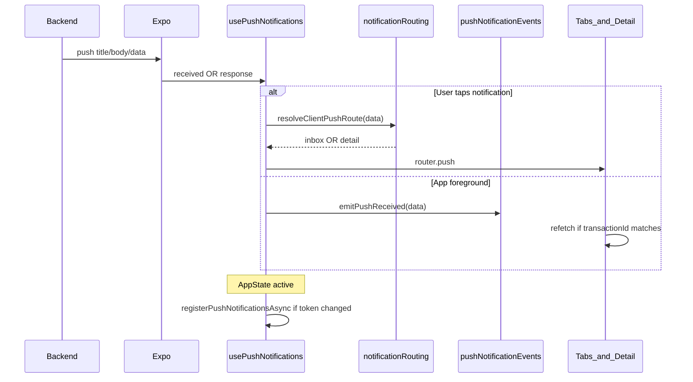

# LivSight — Client push notifications implementation

Developer guide for how **appClient** integrates Expo push notifications with `backend_core` via the API gateway.

**See also:**

- [PUSH_NOTIFICATIONS_CLIENT.md](./PUSH_NOTIFICATIONS_CLIENT.md) — backend payload spec (French)
- [messaging-client-implementation.md](./messaging-client-implementation.md) — inbox / ticket chat (tap target for `ticket_message`)

**Last updated:** 2026-07-04

---

## Scope

### In scope

- All `ClientPushType` values from the backend: `transaction_created`, `driver_*`, `transaction_status_changed`, `delivery_fee_finalized`, `ticket_message`
- Token lifecycle: register on login, re-sync on app resume, delete on logout
- Tap navigation (background + cold start)
- Foreground receive → refresh relevant screens (no auto-navigation)

### Explicitly not implemented

- Live GPS map, `GET /api/transactions/{id}/driver-location`, polling, « Suivi live » tab
- Badge count API / in-app notification center
- `processing` status → same as any status: open **detail screen** only (timeline « En cours de livraison »)

---

## Architecture



---

## File map

| File | Responsibility |
|------|----------------|
| `lib/push/registerPushNotifications.ts` | Permission, Expo token, `POST /api/push-tokens`, foreground handler |
| `lib/push/pushTokenStore.ts` | Last registered token (skip redundant POST) |
| `lib/push/pushConfig.ts` | `EXPO_PUBLIC_ENABLE_PUSH` gate in dev |
| `lib/api/pushTokens.ts` | HTTP register / delete |
| `lib/push/notificationRouting.ts` | Pure routing: `resolveClientPushRoute`, payload parsing, refresh predicates |
| `lib/push/resolveTransactionDetailPath.ts` | Async: `GET /api/transactions/{id}` → livraison vs expédition path |
| `lib/push/pushNotificationEvents.ts` | `onPushReceived` / `emitPushReceived` (mirrors `sessionEvents`) |
| `lib/push/usePushNotifications.ts` | Hook in root layout: register, tap, cold start, foreground emit, AppState re-sync |
| `lib/push/usePushRefresh.ts` | Screen helper: subscribe + conditional refetch |
| `app/_layout.tsx` | Calls `usePushNotifications` |
| `lib/auth/AuthProvider.tsx` | Deletes push token on logout |

### Screen subscriptions (foreground refresh)

| Screen | File | Refresh when |
|--------|------|--------------|
| Livraison list | `app/(tabs)/livraison.tsx` | Any transaction push type, or matching `transactionId` |
| Conversations | `app/conversations.tsx` | `ticket_message` |
| Livraison detail | `app/livraison-detail/[id].tsx` | Push `transactionId` matches open `id` |
| Expédition detail | `app/expedition-detail/[id].tsx` | Push `transactionId` matches open `id` |

---

## Routing table

Central function: `resolveClientPushRoute(data)` in `lib/push/notificationRouting.ts`.

| `data.type` | Route | Expo Router path |
|-------------|-------|------------------|
| `transaction_created` | detail | `/livraison-detail/[id]` or `/expedition-detail/[id]` |
| `driver_assigned` | detail | same |
| `driver_reassigned` | detail | same |
| `driver_cleared` | detail | same |
| `transaction_status_changed` | detail | same (incl. `processing` — no live tab) |
| `delivery_fee_finalized` | detail | same |
| `ticket_message` + `channel === "client"` (or absent) | inbox | `/inbox/[id]` (`id` = `transactionId`) |
| `ticket_message` + `channel === "driver"` | ignore | — |
| Unknown type + `transactionId` | detail (fallback) | resolved path |
| Unknown type, no id | ignore | — |

Detail path resolution (`resolveTransactionDetailPath`):

1. `getTransactionById(transactionId)`
2. If `isExpeditionType(tx.type)` → `/expedition-detail/{navId}`
3. Else → `/livraison-detail/{navId}`

`navId` prefers `transactionReference` when present (matches existing detail screens).

---

## Foreground refresh contract

When a push arrives while the app is in the foreground:

1. `usePushNotifications` → `addNotificationReceivedListener`
2. `parsePushReceivedPayload(data)` → `{ type, transactionId?, ticketId? }`
3. `emitPushReceived(payload)` — no navigation
4. Subscribed screens call existing loaders via `usePushRefresh(shouldRefresh, onRefresh)`

Helper predicates in `notificationRouting.ts`:

- `shouldRefreshLivraisonList(payload)` — transaction types or matching id
- `shouldRefreshConversations(payload)` — `ticket_message` only
- `matchesOpenTransaction(payload, openId)` — detail screens

---

## Token lifecycle

```
Login OK (AuthProvider + usePushNotifications)
  → shouldRegisterPushNotifications() (dev: EXPO_PUBLIC_ENABLE_PUSH=true)
  → permission + getExpoPushTokenAsync
  → POST /api/push-tokens (skip if token unchanged in pushTokenStore)

AppState → active (authenticated)
  → registerPushNotificationsAsync() again (upsert if changed)

Logout
  → DELETE /api/push-tokens (best-effort in AuthProvider)
```

Dev flag (`.env`):

```env
EXPO_PUBLIC_ENABLE_PUSH=true
```

Push registration is **disabled in `__DEV__` by default** unless this flag is set. Use a **physical device** — iOS simulator does not receive real remote pushes.

---

## Local testing

### Prerequisites

1. `.env`: `EXPO_PUBLIC_GATEWAY_URL` pointing to your gateway (LAN IP on phone, not `localhost`)
2. `EXPO_PUBLIC_ENABLE_PUSH=true`
3. Physical device with dev client or EAS build (Expo Go push is limited on SDK 53+)
4. Backend running with Expo push configured

### Commands

```bash
npx expo start --clear   # after .env change
npm run start:dev        # dev client
```

### Manual test matrix

| Step | Trigger | Expected |
|------|---------|----------|
| 1 | Login on device | Log `Push token registered`; `POST /api/push-tokens` 200 |
| 2 | Create order | Push `transaction_created` (if server flag enabled) → tap → correct detail |
| 3 | Agent assigns driver | `driver_assigned` → tap → detail |
| 4 | Status → `processing` | `Livraison en cours` → tap → detail (no live map) |
| 5 | Status → `completed` | Tap → detail |
| 6 | Agent replies on client ticket | `ticket_message` → tap → `/inbox/[id]` chat |
| 7 | Foreground on Livraison tab | Receive status push → list refreshes without tap |
| 8 | Foreground on open detail | Matching `transactionId` → detail reloads |
| 9 | Logout | `DELETE /api/push-tokens`; no further pushes |

**Debug:** if no push, check `push_tokens` table for client `user_id` and backend logs `Push skipped (no token)`.

---

## Tests (TDD)

| Test file | Covers |
|-----------|--------|
| `__tests__/lib/push/notificationRouting.test.ts` | Every `ClientPushType`, driver ticket ignored, url fallbacks, refresh predicates |
| `__tests__/lib/push/resolveTransactionDetailPath.test.ts` | Expedition vs livraison path |
| `__tests__/lib/push/pushNotificationEvents.test.ts` | emit / subscribe |
| `__tests__/api/pushTokens.test.ts` | Register / delete HTTP |

```bash
npm test
```

---

## Related docs

- [PUSH_NOTIFICATIONS_CLIENT.md](./PUSH_NOTIFICATIONS_CLIENT.md) — backend catalogue & payload fields
- [messaging-client-implementation.md](./messaging-client-implementation.md) — ticket chat opened from `ticket_message`
- [DELIVERY_TRACKING_MOBILE.md](./DELIVERY_TRACKING_MOBILE.md) — GPS live (not implemented in client app)
